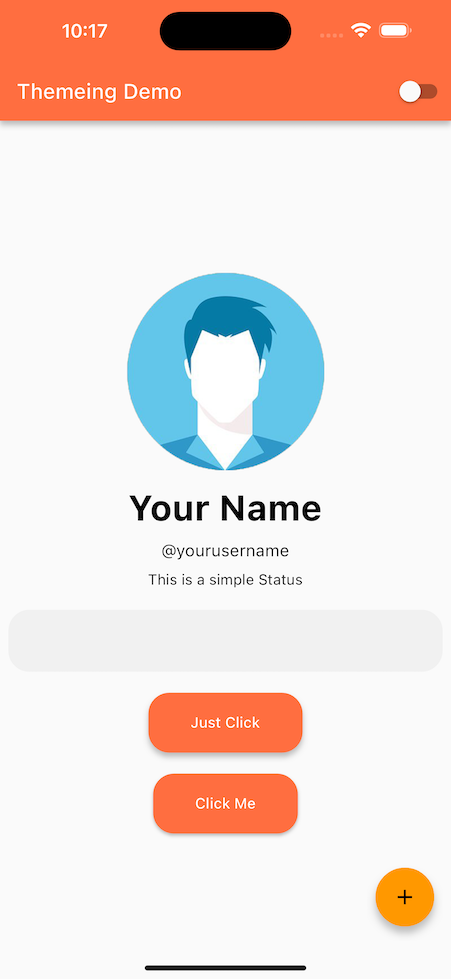
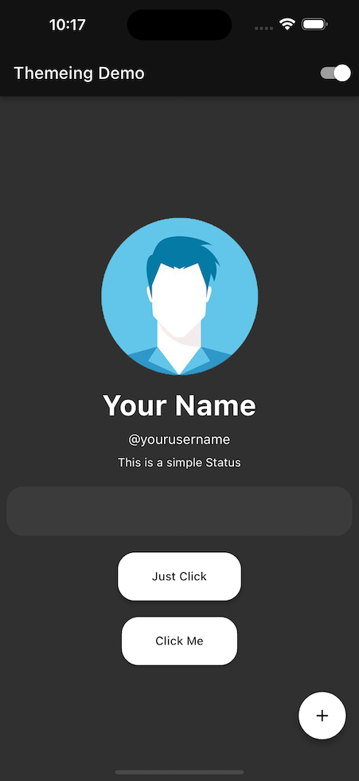

# Flutter Theme Demo Using Flutter 3.x and Riverpod 2.x

This project is an implementation of [RetroPortal Studio's](https://www.youtube.com/@RetroPortalStudio) flutter tutorial [Theme your Flutter Apps like a PRO | Flutter UI Design | Dark Mode in Flutter](https://www.youtube.com/watch?v=6YuQEVN6j-g). It includes a simple statemanagement solution using Riverpod 2 to toggle between light and dark modes, and has been updated from the original video to work in Flutter 3.

 
